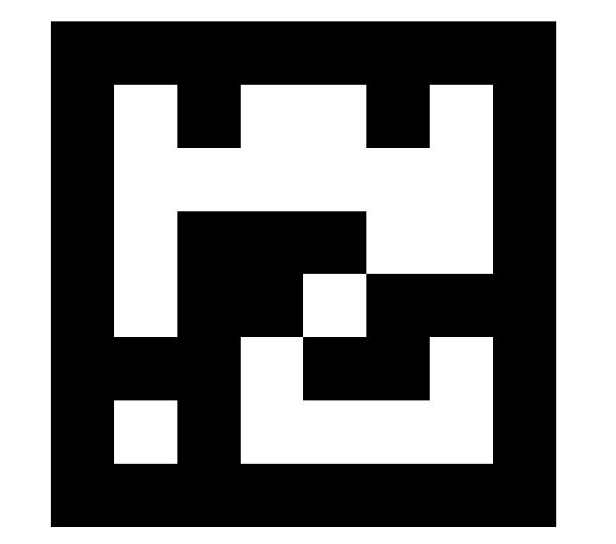
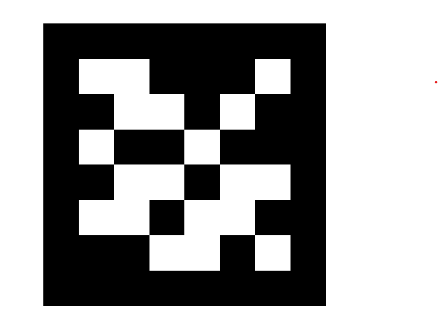

# 🛸 ArUco Marker Detection Drone

This project integrates **OpenCV ArUco marker detection** with a **Bitcraze Crazyflie** nano-drone to enable **vision-based autonomous navigation**.  
The drone identifies specific ArUco markers in real time and performs corresponding flight maneuvers.

---

## 📌 Features
- **Real-time ArUco detection** (`DICT_4X4_50` & `DICT_5X5_50` supported)
- **Crazyflie drone control** via the `cflib` Motion Commander API
- **Marker ID → Flight Command mapping** for customizable navigation
- Live video feed with detected markers and command overlays
- Works with USB or built-in laptop camera

---

## 🎯 Marker Commands
| Marker ID | Command       | Action in Drone |
|-----------|--------------|-----------------|
| 8         | Ascend       | Moves up 0.4 m |
| 37        | Land         | Stops all motion |
| 1         | Move Forward | Moves forward 0.2 m |
| 2         | Move Backward| Moves backward 0.2 m |
| 3         | Turn Right   | Rotates 90° clockwise |
| 4         | Turn Left    | Rotates 90° counter-clockwise |

---

## 🖼️ Example ArUco Markers
Below are the ArUco markers used for navigation.  
(Ensure these are printed clearly for accurate detection.)

| ID 1 | ID 2 | ID 3 |
|------|------|------|
|  |  |  |

| ID 4 | ID 8 | ID 37 |
|------|------|-------|
|  |  |  |

---

## 🛠️ Installation
```bash
# Clone repository
git clone https://github.com/yourusername/ArucoMarkerDetectionDrone.git
cd ArucoMarkerDetectionDrone

# Install dependencies
pip install opencv-python numpy cflib
